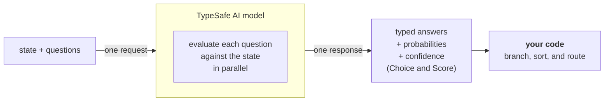

<!--
Source: https://docs.typesafe.ai — five pages, fetched 2026-09-23 as the raw markdown the
docs site serves at <page>.md (verbatim, including MDX components such as the interactive
ConfidenceExplorer on the Confidence page). Not included: Primitives (mostly an embedded
JS widget), Quick Start, State, per-pattern subpages. The docs are changing: several
URLs cited by third-party coverage (e.g. /concepts/confidence) no longer resolve.
-->


<!-- ===== https://docs.typesafe.ai/introduction ===== -->

> ## Documentation Index
> Fetch the complete documentation index at: https://docs.typesafe.ai/llms.txt
> Use this file to discover all available pages before exploring further.

# Introduction

> Jev is TypeSafe's flagship model and the first System One model. Send state and typed questions; get structured answers your code can use directly.

Large language models (LLMs) are designed to produce text for humans to read. When you need a model to make a judgment that your code will consume, that creates a mismatch: you are coercing a text-generation system into outputting structured decisions, then parsing the results back into something your code can depend on.

Jev is TypeSafe's flagship model and the first [System One model](/concepts/system-one). System One models are built to make fast, structured decisions that software can use directly. Jev evaluates typed *questions* against a *state* and returns structured results directly. No text generation, no parsing. You get typed values and probability distributions that your code can branch on, sort by, and route with. Choice and Score also return [confidence](/confidence), which your code can use to decide whether and how to act on an answer.



## TypeSafe primitives

TypeSafe exposes three *AI primitives*. Similar to software primitives, our AI primitives are modular, composable, structured, reliable, and fast. Each asks a different type of *question* and returns a different type of answer.

| Question type                | Goal                         | Returns                                 |
| ---------------------------- | ---------------------------- | --------------------------------------- |
| [Choice](/primitives/choice) | Choose an option from a list | `choice`, `probabilities`, `confidence` |
| [Score](/primitives/score)   | Score the state on a rubric  | `score`, `probabilities`, `confidence`  |
| [Noul](/primitives/noul)     | Is this statement true?      | `noul` (0–1)                            |

All three *question* types can be mixed in a single API call. Every *question* is evaluated in parallel and in isolation against the same *state* in one go. Adding questions barely changes the response time. Each question is evaluated independently, so adding more questions does not create context-rot.

## Atomic questions, composed in code

System One models work best when each question asks one specific, well-scoped thing. Think of each question as a gut-check determination: the kind of judgment a highly knowledgeable person could make in a few seconds given the right context.

If the question you want to ask would require extended reasoning or weighs multiple independent factors, decompose it. Ask each factor as a separate question, then combine the results with logic in your code. This keeps each individual evaluation reliable and gives you full control over how dimensions are weighted.

For example, instead of "rate this startup pitch," ask separately about market size, technical feasibility, and differentiation. Combine the scores with your own formula. When priorities shift, change a coefficient in your code rather than rewriting a prompt.

## Next steps

* [Quick Start](/introduction/quickstart) — Everything you need to get started immediately.
* [AI Primer](/introduction/machine-learning-primer) — Why TypeSafe trains models for calibrated decisions instead of generated text.
* [Primitives (Questions)](/primitives) — How to define questions, choose between Choice, Score, and Noul, and ask several at once.
* [Confidence](/confidence) — How TypeSafe reports certainty, and how to use it architecturally.
* [Patterns](/patterns) — Common patterns for building systems with TypeSafe.


<!-- ===== https://docs.typesafe.ai/concepts/system-one ===== -->

> ## Documentation Index
> Fetch the complete documentation index at: https://docs.typesafe.ai/llms.txt
> Use this file to discover all available pages before exploring further.

# System One

> System One models make fast, structured decisions for software. Jev is TypeSafe's flagship model and the first System One model.

System One models are a class of AI models built to make fast, structured decisions that software can use directly. A System One model evaluates a [state](/concepts/state) and returns typed answers and probabilities.

Jev is TypeSafe's flagship model and the first System One model.

Like an LLM, a System One model understands natural-language input. It returns typed decisions and probabilities rather than generated text.

<Note>
  Jev currently accepts text input only. It evaluates strings, JSON objects, and arrays of text. Images, audio, and video are not supported (yet).
</Note>

## How it differs from an LLM

System One models are trained for calibrated decisions: their probabilities are optimized against outcomes to reflect uncertainty. Calibration is measured across groups of predictions; it does not guarantee that an individual answer is correct.

System One models do not write replies, produce code, or generate explanations of their reasoning. You define the possible answers through [primitives](/primitives):

| Primitive                    | Question                              | Example answer space                          | Example output      |
| ---------------------------- | ------------------------------------- | --------------------------------------------- | ------------------- |
| [Choice](/primitives/choice) | Which team should handle this ticket? | `billing`, `technical`, or `account`          | `choice: "billing"` |
| [Score](/primitives/score)   | How frustrated is this customer?      | 0 = calm, 1 = frustrated, 2 = very frustrated | `score: 1.4`        |
| [Noul](/primitives/noul)     | Does this message request a refund?   | True or false                                 | `noul: 0.95`        |

These are illustrative configurations and values. The primitive pages describe the available configuration options and full response fields.

Read the [AI primer](/introduction/machine-learning-primer) to learn how System One models work and how they are trained.

<Note>
  The System One name comes from the concept Daniel Kahneman popularized in his book *Thinking, Fast and Slow*. System 1 thinking is fast and intuitive. System 2 is slower and more deliberate. Here, the emphasis is on fast, focused judgments.
</Note>

## Fast judgments inside a larger workflow

For a refund request, your application can:

1. Build a state containing the customer's message, the relevant transactions, and the refund policy.
2. Ask independent questions together: whether a refund was requested, whether the evidence indicates a duplicate charge, and whether the policy supports a refund.
3. Combine the answers with deterministic checks in code, then route the case for action or review.

Once you have seen the primitives in action, you can combine them into a larger system. Because System One models return typed, constrained outputs rather than free-form text, your code can inspect and combine its answers into predictable workflows. See [How to build with TypeSafe](/concepts/how-to-build-with-system-one) for the full workflow.

Answers from System One models also include [confidence](/confidence), so you can decide when to act and when to escalate to a person or a reasoning model.

## Call a System One model

Call a System One model through one of our [client SDKs](/sdk) or `POST /v1/systemone` in the [HTTP API](/api). The `model` field selects which model handles the request. The examples in these docs use `jev-latest`, which is also the SDK default. See [Models](/models) for the available models, their prices, and their aliases.

Start with [State](/concepts/state) to prepare the input and [Primitives (Questions)](/primitives) to explore the types of questions you can ask.


<!-- ===== https://docs.typesafe.ai/introduction/machine-learning-primer ===== -->

> ## Documentation Index
> Fetch the complete documentation index at: https://docs.typesafe.ai/llms.txt
> Use this file to discover all available pages before exploring further.

# AI primer

> Why TypeSafe trains decision models with calibrated probabilities instead of optimizing for generated text.

Most AI products are built around a conversation between a model and a person. TypeSafe starts from a different bet: large-scale automation will be dominated by AI-to-AI and AI-to-software interactions, so the machine interface matters more than the chat interface.

> **We call this Machine Native Intelligence:**
>
> AI with software-like properties such as structure, reliability, observability, testability, speed, consistency, and low cost.

## Building prod, not God

TypeSafe is not trying to build a model that does everything. It is designed for production systems where code needs a narrow decision it can inspect and act on.

Our expectation is that large-scale AI automation will be closer to 99% machine-to-machine interactions and 1% human interaction. That shifts the design target from responses that feel good to read toward outputs that behave predictably inside software.

Read the [TypeSafe manifesto](https://typesafe.ai/manifesto).

## Three post-training approaches

Pretrained language models have been adapted in two major ways. TypeSafe adds a third. RLHF and RLVR are shown here for context; TypeSafe's training path is RLCD.

<Columns cols={3}>
  <Card title="RLHF" icon="messages-square" type="note">
    **Reinforcement learning from human feedback** turned pretrained models into chatbots. It trains models to produce responses people prefer.
  </Card>

  <Card title="RLVR" icon="brain-circuit" type="note">
    **Reinforcement learning with verifiable rewards** created reasoning models that are strong at tasks such as mathematics, but slower and more expensive.
  </Card>

  <Card title="RLCD" icon="binary" type="tip">
    **Reinforcement learning for calibrated decisions** trains TypeSafe to return decisions and calibrated probabilities instead of generated text.
  </Card>
</Columns>

RLHF was used to train InstructGPT and ChatGPT and was [co-invented by Diogo Almeida](https://scholar.google.com/citations?user=0T4y07QAAAAJ\&hl=en), cofounder of TypeSafe.

<Frame>
  

  
</Frame>

## RLCD and calibrated decisions

RLCD optimizes for a different output contract:

* The model does not generate text.
* It returns decisions and probabilities.
* Higher probability should correspond to a greater chance that the answer is correct.

Calibration makes uncertainty usable by software. Across many predictions from a well-calibrated model:

* Outcomes assigned a probability of `0.2` should occur about 20% of the time.
* Outcomes assigned a probability of `0.8` should occur about 80% of the time.
* Outcomes assigned a probability of `1.0` should occur 100% of the time.

These rates describe groups of predictions, not a guarantee about any single answer. See [Confidence](/confidence) for guidance on deciding when software should act or escalate.

## The problems with RLHF

RLHF teaches a model to say things that people prefer. That objective works well for chatbots, but it can also reward sycophancy and confident-sounding hallucinations.

Preference optimization also causes **mode dropping**: the model learns to favor a particular style, such as instruction following, while reducing the probability of other possible outputs.

<Frame>
  

  
</Frame>

<Warning>
  An output can be compelling to a person without being reliable enough for unattended automation. Human preference and machine trustworthiness are different optimization targets.
</Warning>

Mode dropping is a milder version of **mode collapse**. In the classic generative-adversarial-network failure mode, a generator learns to produce the same kind of output repeatedly because that output continues to fool the discriminator.

<Accordion title="Mode collapse analogy">
  <Frame>
    

    
  </Frame>
</Accordion>

RLHF remains a good fit for conversational models. TypeSafe's position is that production automation needs a different training objective—one centered on constrained decisions and calibrated uncertainty.


<!-- ===== https://docs.typesafe.ai/confidence ===== -->

> ## Documentation Index
> Fetch the complete documentation index at: https://docs.typesafe.ai/llms.txt
> Use this file to discover all available pages before exploring further.

# Confidence

> How TypeSafe reports certainty, how it differs from probability, and how to use it to control system behavior.

export function ConfidenceExplorer() {
  const [probabilities, setProbabilities] = useState([90, 6, 4]);
  const options = ["A", "B", "C"];
  function changeProbability(index, value) {
    setProbabilities(current => {
      const others = [0, 1, 2].filter(i => i !== index);
      const remaining = 100 - value;
      const previousRemaining = current[others[0]] + current[others[1]];
      const next = [...current];
      next[index] = value;
      next[others[0]] = previousRemaining > 0 ? remaining * current[others[0]] / previousRemaining : remaining / 2;
      next[others[1]] = remaining - next[others[0]];
      return next;
    });
  }
  function formatProbability(value) {
    if (Math.abs(value - 100 / 3) < 0.000001) return "33⅓%";
    return `${Number(value.toFixed(1))}%`;
  }
  function choiceConfidence(values) {
    const count = values.length;
    const peak = Math.max(...values) / 100;
    return Math.max(0, Math.min(1, (count * peak - 1) / (count - 1)));
  }
  const confidence = choiceConfidence(probabilities);
  const maximum = Math.max(...probabilities);
  const winners = options.filter((option, i) => Math.abs(probabilities[i] - maximum) < 0.000001);
  const selected = winners.length === 1 ? `Option ${winners[0]}` : `Tie: ${winners.join(", ")}`;
  const buttonClass = "border px-3 py-2 text-sm hover:bg-zinc-100 dark:hover:bg-zinc-800 focus-visible:outline focus-visible:outline-2 focus-visible:outline-offset-2 focus-visible:outline-pink-500";
  const buttonStyle = {
    borderColor: "#71717a"
  };
  const eyebrow = {
    fontSize: "0.6875rem",
    fontWeight: 700,
    letterSpacing: "0.08em",
    textTransform: "uppercase"
  };
  return <section aria-label="Explore probabilities and confidence" className="not-prose my-6 border border-zinc-300 dark:border-zinc-700 p-5 sm:p-6 text-zinc-800 dark:text-zinc-200">
      <div className="flex flex-wrap items-start justify-between gap-4">
        <div>
          <div className="text-zinc-600 dark:text-zinc-400" style={eyebrow}>Choice question with three options</div>
          <div className="mt-2 text-base font-semibold">See how probability distribution changes confidence</div>
        </div>
        <div className="text-right" role="status" aria-live="polite" aria-atomic="true">
          <div className="text-sm text-zinc-600 dark:text-zinc-400">Confidence</div>
          <output className="block text-3xl font-semibold tabular-nums" style={{
    color: "#E551BA"
  }}>
            {confidence.toFixed(2)}
          </output>
        </div>
      </div>

      <div role="img" aria-label={`Probability distribution: ${options.map((option, i) => `${option} ${formatProbability(probabilities[i])}`).join(", ")}. ${selected}.`} className="my-6">
        <div className="text-xs text-zinc-600 dark:text-zinc-400">Probability</div>
        <div aria-hidden="true" style={{
    position: "relative",
    height: "180px",
    margin: "34px 0 36px 44px"
  }}>
          {[0, 50, 100].map(tick => <div key={tick} style={{
    position: "absolute",
    bottom: `${tick}%`,
    width: "100%",
    borderBottom: "1px solid",
    borderColor: "color-mix(in srgb, currentColor 18%, transparent)"
  }}>
              <span className="text-xs" style={{
    position: "absolute",
    right: "calc(100% + 8px)",
    transform: "translateY(-50%)"
  }}>{tick}%</span>
            </div>)}
          <div style={{
    position: "absolute",
    inset: 0,
    display: "flex",
    justifyContent: "space-around",
    alignItems: "flex-end"
  }}>
            {options.map((option, index) => <div key={option} style={{
    position: "relative",
    width: "21%",
    height: `${probabilities[index]}%`
  }}>
                <span className="text-sm font-semibold tabular-nums" style={{
    position: "absolute",
    bottom: "calc(100% + 6px)",
    left: "50%",
    transform: "translateX(-50%)",
    whiteSpace: "nowrap"
  }}>{formatProbability(probabilities[index])}</span>
                <div style={{
    height: "100%",
    background: winners.length === 1 && winners[0] === option ? "#E551BA" : "currentColor",
    opacity: winners.length === 1 && winners[0] === option ? 1 : 0.45
  }} />
                <span className="text-sm" style={{
    position: "absolute",
    top: "calc(100% + 8px)",
    left: "50%",
    transform: "translateX(-50%)"
  }}>{option}</span>
              </div>)}
          </div>
        </div>
      </div>

      <div className="space-y-3">
        {options.map((option, index) => <label key={option} className="flex items-center gap-3 text-sm">
            <span className="w-5 font-semibold">{option}</span>
            <input type="range" min="0" max="100" step="1" value={probabilities[index]} onChange={event => changeProbability(index, Number(event.target.value))} aria-label={`Probability of ${option}`} aria-valuetext={formatProbability(probabilities[index])} className="min-w-0 flex-1 cursor-pointer" style={{
    accentColor: "#E551BA",
    minHeight: "44px"
  }} />
            <output className="w-16 text-right tabular-nums">{formatProbability(probabilities[index])}</output>
          </label>)}
      </div>
      <p className="mt-3 text-sm text-zinc-600 dark:text-zinc-400">Move a slider to change an option's probability. The other probabilities adjust to keep the total at 100%.</p>

      <div className="mt-4 flex flex-wrap gap-2" aria-label="Example distributions">
        <button type="button" className={buttonClass} style={buttonStyle} onClick={() => setProbabilities([90, 6, 4])}>Clear winner</button>
        <button type="button" className={buttonClass} style={buttonStyle} onClick={() => setProbabilities([40, 33, 27])}>Spread out</button>
        <button type="button" className={buttonClass} style={buttonStyle} onClick={() => setProbabilities([100 / 3, 100 / 3, 100 / 3])}>Even split</button>
      </div>
      <div className="mt-4 text-sm" aria-live="polite">{winners.length === 1 ? `Selected: ${selected}` : selected}</div>
      <details className="mt-4 text-sm text-zinc-600 dark:text-zinc-400">
        <summary className="cursor-pointer">How this demo calculates Confidence</summary>
        <p className="mt-3">TypeSafe computes confidence from how the probability is spread across the options. All of it on one option gives 1.0; the more evenly it spreads, the lower the confidence. This demo uses <code>(3 × largest probability − 1) / 2</code> to approximate confidence for three options.</p>
      </details>
    </section>;
}

All Score and Choice answers from TypeSafe include a `probabilities` property representing the probability distribution across the options (for Choice) or levels (for Score). The *shape* of that distribution is what tells you how certain the model is: concentrated on one outcome means a confident answer, spread out means an uncertain one.

The answer's `confidence` property collapses that shape into a single number from 0 to 1, so you can threshold on it without doing the math yourself. (Noul answers don't carry one.)

## Confidence is derived from the probabilities

`confidence` is a statistic computed from the probability distribution the answer already gives you. TypeSafe computes it for you and returns it on every Choice and Score answer, so the common case needs no extra work on your side.

<ConfidenceExplorer />

<Note>
  **A solid default:** We provide `confidence` as a convenient measure that fits most use-cases, but you are never locked into our definition. Depending on what you are evaluating, a different measure may serve you better, which is exactly why we give you the full `probabilities` in the response. The pros and cons of different computations is a specialized topic that we'll keep to a separate cookbook rather than this page, and will add the link here when we do!
</Note>

For a [Choice](/primitives/choice), the distribution is `probabilities` across your options. For a [Score](/primitives/score), it is the distribution across your levels. In both cases a flatter distribution means lower confidence: low confidence on a Choice often means none of the options are a clear winner over the others, and low confidence on a Score often means the levels are ambiguous, multi-dimensional, or the state doesn't contain enough to go on.

## "I don't know" is a useful signal

If an intelligent system, whether human or machine, cannot express honest uncertainty, the system cannot be trusted.

Confidence gives you a built-in mechanism for the model to say "I'm not sure about this one." This lets your code implement different behavior for different levels of certainty, which is the foundation for building systems you can actually rely on.

## Three paths for using confidence in your code

A useful starting pattern is to divide confidence into three ranges, each producing a different system behavior:

**High confidence:** Act automatically. The model has a clear read and you can proceed without human involvement.

**Medium confidence:** Proceed with caution. The model has a reasonable answer but is not certain. Depending on context, you might ask the user to confirm, flag for review, or gather more information before acting.

**Low confidence:** Do not act. Route to a human, request clarification, or fall back to a different system. The model is telling you it does not have enough information or the question is not a good fit.

Where you draw those boundaries depends on the stakes.

## Thresholds scale with risk

A confidence threshold is not one number. Different actions within the same system should be gated at different levels depending on the consequences of getting it wrong.

```python theme={null}
response = client.system_one(
    state=user_message,
    questions={
        "action": Choice(
            instructions="What is the user trying to do?",
            criteria={
                "check_balance": "View account balance",
                "approve_transfer": "Approve the pending withdrawal request",
                "support": "Get help with an issue",
            },
        ),
    },
)

action = response.answers["action"]
confidence = action.confidence

if confidence < 0.5:
    # Model is genuinely unsure. Don't guess.
    route_to_human(user_message)

elif action.choice == "check_balance":
    # Low stakes. Showing the wrong screen is recoverable.
    show_balance(account_id)

elif action.choice == "approve_transfer":
    if confidence > 0.9:
        # High stakes, high confidence. Proceed with confirmation.
        confirm_then_execute(account_id)
    else:
        # High stakes, moderate confidence. Verify first.
        ask_user_to_confirm(account_id)
```

The 0.5 confidence floor catches anything the model reports as genuinely uncertain. Above that, the threshold for acting without confirmation is higher for a destructive operation than for a read-only one. Your code encodes the risk tolerance.

<Note>
  The correct threshold values depend on your domain and the performance of the model for your use case. Start with conservative thresholds, test with your own data, and adjust as you observe results.
</Note>


<!-- ===== https://docs.typesafe.ai/patterns ===== -->

> ## Documentation Index
> Fetch the complete documentation index at: https://docs.typesafe.ai/llms.txt
> Use this file to discover all available pages before exploring further.

# Patterns

> Architectural patterns for building systems with TypeSafe.

TypeSafe is designed to sit within a larger system, powering decisions with AI. Learning to think in terms of discrete, atomic decisions that compose into complex system behavior is a key skill for getting the most out of TypeSafe.

This section assumes you know the [TypeSafe primitives](/primitives) and understand [how confidence works](/confidence). If not, read those first.

## The patterns

| Pattern                                                  | What it does                                                                                               | Benefits                 |
| -------------------------------------------------------- | ---------------------------------------------------------------------------------------------------------- | ------------------------ |
| [Speculative Fan-Out](/patterns/fan-out)                 | Send many questions in a single call, including speculative ones, and let your code decide what's relevant | Cost, Speed              |
| [Confidence-Gated Routing](/patterns/confidence-routing) | Utilize confidence as a second decision axis to build safer systems                                        | Reliability, Safety      |
| [Composite Scoring](/patterns/composite-scoring)         | Combine several dimensions of analysis into a single score                                                 | Cost, Reliability, Speed |
| [Intent Routing](/patterns/intent-routing)               | Classify a user's intent and route to the appropriate handler                                              | Cost, Speed              |

<Tip>
  We're always keen to learn how people are making use of our primitives. If you've found a killer use case you think should be mentioned here, feel free to drop us a note!
</Tip>
