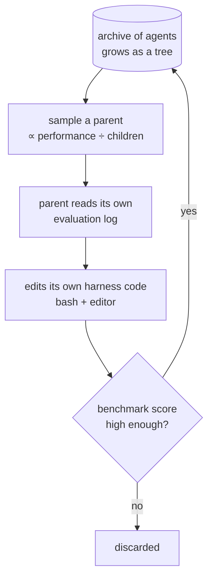

# Evolutionary program search

Evolution fits problems where the search space is large or oddly shaped and candidates are
hard to optimize by gradient but easy to **evaluate**. Harness code qualifies, which is why
this family — mutate a population of programs, keep what scores — has become the main
alternative to hand-designing a [[harness]]. The interesting results are not the headline
scores but three structural findings: what the search actually discovers, the assumption
that makes it work in coding and nowhere else, and the regime where it fails outright.

The rest of the harness optimization ladder is on [[self-improving-harness]].

## From prompts to programs

The lineage starts in prompt space. **Promptbreeder** (Fernando et al. 2023) evolves
task prompts through mutation operators, and self-referentially evolves the *mutation
prompts* too. **GEPA** (Agrawal et al. 2025) — "reflective prompt evolution can outperform
reinforcement learning" — uses natural-language reflection over trial-and-error
trajectories to propose updates.

**AlphaEvolve** (Novikov et al. 2025) moves to programs: a pool of candidates, frozen LLMs
generating diffs, survivors kept, repeat. Three design details carried forward by everything
after it:

- The prompt carries parent programs, their results, instructions, and meta-information.
- The agent sees the whole repo, but improvable regions are explicitly fenced:
  `# EVOLVE-BLOCK-START` / `# EVOLVE-BLOCK-END`.
- The **meta-prompt co-evolves** with the instructions and context.

**ShinkaEvolve** (Lange et al. 2025) attacks sample efficiency three ways: parent sampling
that balances performance rank against offspring count, embedding-cosine **rejection of
candidates too similar to the population**, and a meta-scratchpad recording patterns from
successful solutions. The middle one is an explicit countermeasure to diversity collapse.

**ThetaEvolve** (Wang et al. 2025) is the open-source answer to AlphaEvolve, and its
complaint locates something the others miss: AlphaEvolve "is a pure inference system that
models cannot internalize the evolving strategies"
([[harness-survey-arxiv-abstracts]]). Adding test-time RL fixes that — RL-trained
checkpoints show faster progress and better final performance **on unseen tasks**, meaning
the evolving capability moved into the weights. It also gets a small open-source model
(DeepSeek-R1-0528-Qwen3-8B) to new best-known bounds on circle packing and the first
autocorrelation inequality, using a single LLM instead of frontier ensembles, with "lazy
penalties" discouraging stagnant output.

That result is the concrete version of the prediction on [[harness]] that harness
improvements eventually get **internalized** into model behavior — here it is measured
rather than forecast.

## Darwin Gödel Machine: proof replaced by benchmark

**DGM** (Zhang et al. 2025) points the machinery at harness code itself: a coding agent
permitted to modify its own repository. The conceptual move is a substitution.
Schmidhuber's Gödel machine required *proving* each self-modification net-beneficial, which
is impractical; DGM **empirically validates each change on coding benchmarks** instead
([[harness-survey-arxiv-abstracts]]). Everything else follows from accepting evidence in
place of proof.

What separates this from hill-climbing is the node at the top: survivors return to an
**archive**, not to a single current-best. Many lineages stay alive at once, which is what
"open-ended" buys — and the `÷ children` term in the sampling rule is the pressure that stops
one successful branch from monopolizing the next generation.

The loop: start with one agent; each iteration sample a parent with probability proportional
to performance and **inversely to its number of children**; have it read its own benchmark
evaluation log and propose improvements to its own harness codebase using two tools (`bash`,
and an `editor` supporting `view/create/edit`); evaluate; admit the good ones. The archive
grows into a tree, so many paths are explored in parallel rather than one hill climbed.

Under a fixed `Claude 3.5 Sonnet` and a minimal starting harness: SWE-bench Verified
**20.0% → 50.0%**, Polyglot **14.2% → 30.7%**, beating baselines with neither
self-improvement nor open-ended exploration.

What it discovered is more informative than the deltas: **better code editing tools,
long-context window management, and peer-review mechanisms**. Those are the same components
a human harness engineer would reach for, and two of the three are memory and context
management — converging on the patterns on [[harness]] from a blind search. All experiments
ran with sandboxing and human oversight ([[harness-reward-hacking]]).

## The alignment assumption, and why it only holds in coding

**Hyperagents** (Zhang et al. 2026) identifies the load-bearing coincidence in the DGM
result, and it reframes what that result means. DGM works because **evaluation and
self-modification are both coding tasks**, so improvements in coding ability convert
directly into improvements in self-improvement ability. The loop compounds because the skill
being measured and the skill being applied are the same skill.

**That alignment does not generally hold outside coding.** An agent that gets better at,
say, legal reasoning does not thereby get better at rewriting the program that does legal
reasoning — so the recursion flattens into ordinary search.

Hyperagents removes the assumption by merging the task agent and the meta agent into a
**single editable program in which the modification procedure is itself editable** —
metacognitive self-modification, improving not just behavior but the mechanism generating
future improvements. DGM-H extends DGM this way, and the result that matters is transfer:
its meta-level improvements — persistent memory, performance tracking — **carry across
domains and accumulate across runs**, which a domain-specific task improvement never does.

This is the strongest available evidence for the survey's claim that harness engineering
trends toward *meta-methodology* rather than better answers ([[harness]]). It also explains
why coding-agent harnesses got good first, and why that head start does not automatically
generalize.

## Where self-rollout evolution breaks

**DemoEvolve** (Che et al. 2026) is usually filed as "add human demonstrations to the
archive," which undersells it. It is a boundary condition
([[harness-survey-arxiv-abstracts]]).

| Regime | Example | Self-rollout evolution |
| --- | --- | --- |
| short episodes, attributable failures | Liar's Dice | works |
| long-horizon, stochastic, sparse reward | Balatro | **fails** — misled by sparse feedback and candidate-selection noise |

In the hard regime the search is not merely slow, it is *misled*: noise in candidate
selection is indistinguishable from signal, so the population drifts. Tutorial-like textual
knowledge alone does not rescue it either — which rules out the obvious cheap fix.
Competent human trajectories, used as reference experience for the coding proposer, do,
producing edits that are more diagnosable and localizable as well as better-scoring.

The finding generalizes past games. Every automated harness loop depends on being able to
attribute a failure to a mechanism, which is exactly what Self-Harness's verifier-grounded
failure patterns and AHE's observability pillars are engineering around
([[self-improving-harness]]). DemoEvolve says what happens when attribution is genuinely
unavailable: the loop does not degrade gracefully, it goes wrong.

## The honest scope

This family works where fitness is cheap, automatic, and unambiguous — matrix
multiplication, GPU kernels, algorithm contests, datacenter scheduling — and struggles
wherever evaluation is slow, ambiguous, or heuristic ([[auto-research-evaluation]]).
Compute efficiency is a standing concern; ShinkaEvolve and ThetaEvolve exist mostly to
address it.

Diversity collapse is the failure mode intrinsic to the method rather than to its
evaluators: selection pressure sharp enough to reject bad candidates also prunes the
initially-worse-looking candidate that was the point of searching. The two countermeasures
in use are both structural rather than semantic — inverse-offspring parent sampling (DGM)
and embedding-similarity rejection (ShinkaEvolve) — and neither addresses the open-ended
research case, where the best path looks worse under the current evaluator by definition.
See [[harness-reward-hacking]].
