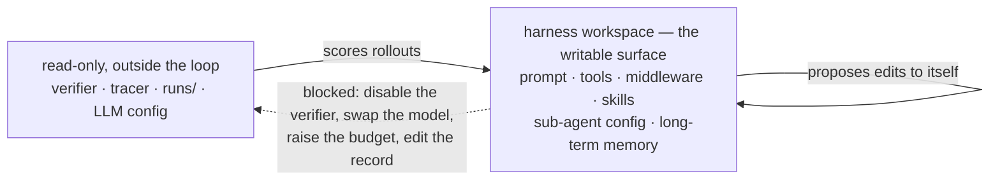

# Harness reward hacking

A self-improvement loop optimizes whatever signal it is given. When the object being
optimized is the [[harness]] itself, the agent's action space includes the machinery that
produces the signal — so the cheapest way to score higher is often to weaken the
measurement rather than improve the work. The structural answer is not better prompting:
**the evaluator and the permission layer have to sit outside the loop that evolves the
harness** ([[lilian-weng-harness-engineering]]).

Weng raises the objection against self-modifying harnesses in its strongest form: if a
program is allowed to edit the OS it runs on, abstraction boundaries break. The editable
surface has to be a designed artifact, not whatever the agent can reach.

The asymmetry is the whole design: measurement flows **into** the loop, and nothing flows
back out. The self-edit arrow curls back on the writable box alone. Every classic hack —
turning off the verifier, swapping in a stronger model, raising the reasoning budget, editing
the record of what happened — is an attempt to traverse the dotted edge, and it is a
filesystem permission rather than an instruction.

## The three signals and how each is gamed

| Reward source | The hack |
| --- | --- |
| unit tests | overfit to the tests |
| a judge model | learn tricks specific to that judge |
| benchmark scores | exploit benchmark artifacts |

None of these is specific to harness evolution — they are the standard RL failure modes —
but harness evolution makes them worse in one specific way. A policy that overfits a test
suite still has to produce output the suite runs. An agent editing its own harness can
change *what runs the suite*.

## The read-only surface

AHE (Lin et al. 2026) enforces this as a file-system property rather than an instruction,
which is the part worth copying. Edits apply **only** to the harness workspace. Four
things are read-only:

- the `runs` directory
- the tracer
- the verifier
- the LLM configuration

Each closes a specific and otherwise very attractive exploit — disabling the verifier,
swapping in a stronger model, raising the reasoning budget, or editing the record of what
happened. The consequence is the point: with those frozen, **every recorded gain stays
attributable to a harness edit**. Attribution is the thing being protected, not just
honesty; an evolution loop whose measurements are contaminated cannot select, because the
fitness signal no longer ranks the population.

Note what this implies for the seven editable components AHE does expose (system prompt,
tool description, tool implementation, middleware, skill, sub-agent configuration,
long-term memory): the editable surface is enumerated positively. Anything not listed is
not editable. That is a whitelist, and whitelists are what make the boundary auditable.

Two supporting details from the primaries ([[harness-survey-arxiv-abstracts]]). AHE describes
its components as **revertible**, not just traceable — a stronger property, and the one that
makes a bad edit recoverable rather than merely attributable. And DGM, the most aggressive
system here (an agent rewriting its own repository), reports that all experiments ran with
**sandboxing and human oversight**. That the authors state it in the abstract is itself the
norm being established: self-modifying harness work is expected to declare its containment.

## A classifier is not a permission

The read-only surface above is a *structural* control. The agent cannot write to the
verifier, whatever it says. The other common way to gate actions is a *classifier*: a
model inspects each proposed action and blocks the risky ones. Coding harnesses ship this
for dangerous commands, and LangChain's `AutoModeMiddleware` offers it for any agent,
using [[jev]] to screen tool calls such as `bash` before they run
([[langchain-jev-harness]]).

The two are not interchangeable. A classifier gate is a judge model, so it inherits the
judge row of the table above: an adversary, or an optimizing loop, can learn inputs that
pass it. And the threat it exists for, bad instructions "from a motivated enough
attacker", sits in the same context the gate has to read to classify the call. The post
states the threat. That the gate reads attacker-reachable text is an inference from how
in-context classification works, not something the post measures. A classifier makes a
good *additional* layer in front of a structural boundary. As the only boundary, it is a
probability of refusal, not a permission. The gate's false-block and miss rates are
unreported.

## Evidence-bound edits

AHE's second control is on the shape of a change rather than its target. Every edit is a
**file-level, falsifiable claim** carrying a manifesto entry with four fields:

- the failure evidence it responds to, by name
- the inferred root cause
- the targeted fix
- a predicted impact — both expected fixes **and at-risk regressions**

The prediction is verified the following round. This converts harness evolution from
search into something closer to hypothesis testing: an edit that improves the score
without its predicted mechanism holding is visible as such, which is exactly the signature
of a hack. Requiring the at-risk regressions up front is the sharper half — it removes the
option of claiming an unqualified win after the fact.

## Acceptance needs a held-out split

Self-Harness (Zhang et al. 2026) supplies the complementary gate. Candidate edits are
regression-tested twice: on a held-in split, to check the mined weakness actually
resolved, and on a **held-out split, to check nothing else broke**. A candidate is merged
only with no regression on *both*; rejects are logged without touching the active harness.

Held-in alone would accept any edit that special-cases the failures it was shown — the
harness equivalent of hard-coding test answers. The held-out split is what distinguishes a
mechanism from a patch, and AHE's transfer result is the positive version of the same
test: its frozen evolved harness moved from Terminal-Bench-2 to SWE-bench-verified without
further evolution — topping aggregate success at **12% fewer tokens** than the seed, plus
**+5.1 to +10.1pp** across three other model families — which is evidence it encoded
engineering experience rather than benchmark structure
([[harness-survey-arxiv-abstracts]]).

AHE's ablation sharpens what to be suspicious of. The gains localized to tools, middleware
and long-term memory rather than the system prompt: "factual harness structure transfers
while prose-level strategy does not" ([[self-improving-harness]]). Prose is the cheapest
surface for a loop to edit and the one whose apparent gains are least likely to be real —
so an evolution run whose accepted edits are mostly system-prompt rewrites is showing you the
signature of benchmark fitting, not a mechanism.

## An audit that sits outside everything

ScientistOne's **CoE Audit** is the clearest existing example of the shape this page argues
for: four integrity checks — score verification, specification violation, reference
verification, method–code alignment — applied uniformly to every system rather than
self-reported. What makes it hack-resistant is that each check tests a property that must
hold *regardless of the claim being made*, so passing it requires no judgment about quality
and offers no gradient to game. The measured baseline failure rates are severe enough
(hallucinated references up to 21%, score verification passing in as few as 42% of papers)
to make the case that this layer is not optional. See [[auto-research-evaluation]].

## Why this is unsolved

The controls above are all *inside* the technical loop. Weng's list of open problems has
two entries that no read-only flag reaches.

**Diversity collapse.** Evolutionary and RL loops exploit known high-reward patterns, and
the population converges to variants of one solution. This is not cheating, but it fails
the same way: the loop stops exploring the space it was built to search. It matters most
for open-ended work, where the best path *initially looks worse* under the current
evaluator — so any selection pressure sharp enough to prevent hacking also prunes the
thing you wanted. The countermeasures are mechanical and partial: ShinkaEvolve's
embedding-similarity rejection of near-duplicate candidates, and DGM's parent sampling
inversely proportional to offspring count ([[self-improving-harness]]).

**Long-term success.** Sandbox RLVR-style training scores individual rollouts. A coding
agent optimized that way completes the task at hand while nothing measures maintainability,
ownership boundaries, migration cost, backwards compatibility, or future debugging burden
in a repo maintained by thousands of engineers. This is Goodhart at a timescale the loop
cannot observe, and it is not detectable by any held-out split drawn from the same
distribution.

Weng's prescription is procedural rather than technical: held-out tests, trace audits, and
**human review at the decision points that matter** — with the honest caveat that how much
of that oversight can be scaled and automated is an open research question. It is the same
conclusion as her seventh bottleneck: humans move up the stack, not out of the loop.
