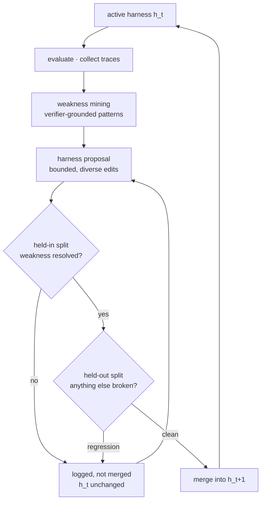
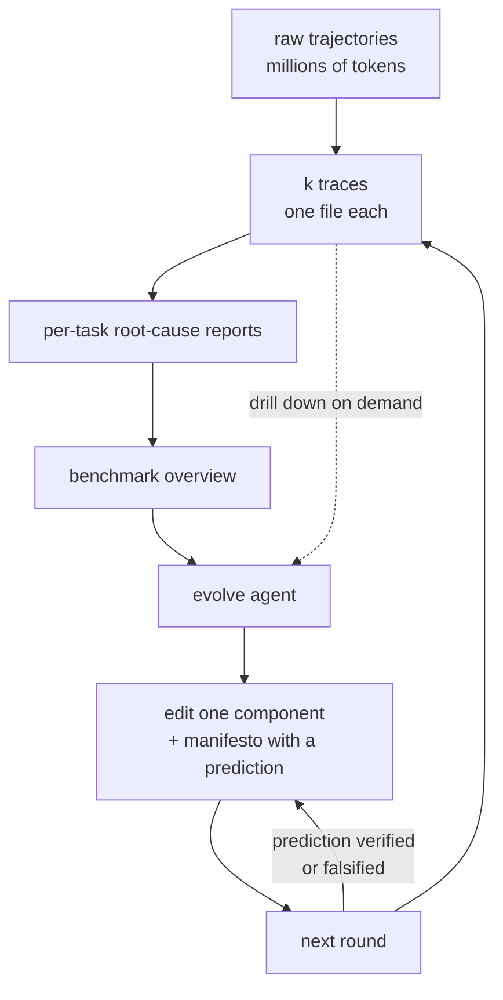

# Self-improving harness

A [[harness]] is code: it programs how prompts, tool calls, subagents, control flow,
memory and workflow logic fit together. That single observation is what turns harness
design into an optimization problem, because **an LLM that can edit code can edit its own
harness**, and the design space reachable that way is far larger than the one reachable
by rewriting prompts ([[lilian-weng-harness-engineering]]). This page covers what happens
when you actually run that loop, and the two results showing why it doesn't work for
everyone.

## The ladder

The object being optimized has climbed steadily:

```
instruction prompts → structured context → workflow → harness code → optimizer code
```

Each rung replaces a hand-written artifact with a searchable one, and each becomes viable
only when the base model is strong enough to search it. The rungs are not alternatives —
a real system optimizes several at once, which is the argument for treating the whole
harness as one object rather than tuning context and workflow separately.

Rung two is [[agentic-context-engineering]]. Rung three, workflow, went the same way:
**ADAS** (Hu et al. 2025) formulates agent design as "meta-agent search" — keep an archive
of agentic workflows seeded with CoT and self-refine, have a meta-agent describe then
*program* a new one inspired by the archive, run two self-refine passes to check novelty,
evaluate, and add the survivors back. **AFlow** (Zhang et al. 2025) instead makes the
workflow a graph — nodes are LLM-invoking actions, edges are logical operations in code —
and runs MCTS over it, expanding a selected node by asking an LLM for a modification
conditioned on that node's measured performance, stopping when the top-$k$ average score
plateaus. AFlow beat both manual workflows and ADAS on QA, code and math.

Rung four is where the harness itself becomes the artifact, and rung five is
**Meta-Harness** (Lee et al. 2026), which optimizes *the code that decides what to store,
retrieve and present* — a harness for optimizing harnesses. Two implementation details
recur across every system at this level and are worth stating as the pattern:

- The execution history lives in the file system, and the proposing agent reads it with
  `grep` and `cat` rather than having it shoveled into one prompt.
- A candidate harness is a **directory**: its own source code, its scores, its rollout
  trajectories, its state updates. Candidates are kept as a Pareto frontier, not a single
  best.

Meta-Harness's stated reason for needing that filesystem access is the sharpest diagnosis
in this literature: **existing text optimizers are poorly matched to harness search because
they compress feedback too aggressively** ([[harness-survey-arxiv-abstracts]]). Summarizing
the feedback discards exactly the specifics an edit would have needed, and which specifics
those are is not knowable at summarization time. Giving the proposer `grep` over raw traces
is not a convenience, it is the fix. The same mechanism appears as brevity bias in
[[agentic-context-engineering]].

It reports +7.7 points over a state-of-the-art context management system **while using 4×
fewer context tokens**, +4.7 points on 200 IMO-level problems averaged across five held-out
models, and harnesses that beat the best hand-engineered baselines on TerminalBench-2.

## STOP, and the capability floor

**Self-Taught Optimizer** (Zelikman et al. 2023) is the early statement of the recursion.
A seed improver takes a solution, a utility function and a black-box model and returns a
better solution, $s' = I(u, s; M)$. The goal is not to improve $s$ but to improve $I$.
Define meta-utility as the improver's average utility across downstream tasks,

$$
\hat{u}(I) \triangleq \frac{1}{\vert\mathcal{D}\vert}\mathbb{E}_{(u,s)\sim \mathcal{D}}[u(I(u,s; M))]
$$

and then apply the improver to itself: $I_t = I_{t-1}(\hat{u}, I_{t-1}; M)$. The improved
improvers discovered genetic algorithms, decomposition, multi-armed prompt bandits,
simulated annealing, temperature variation, and beam/tree search — i.e. they rediscovered
the optimizer literature, which is the encouraging part.

The discouraging part is the headline result of this whole area: **STOP improved mean
downstream performance with GPT-4 and degraded it with GPT-3.5 and Mixtral.** Recursive
structure alone buys nothing. There is a capability floor below which the loop is
actively harmful, because a weak model's edits are worse than no edits and the recursion
compounds them.

## Updating is easy; benefiting is not

Lin et al. (2026) sharpen this by splitting the capability in two:

| Axis | What it measures | How it scales |
| --- | --- | --- |
| harness-**updating** | producing a useful harness edit | roughly **flat** across model sizes |
| harness-**benefit** | exploiting an updated harness | **non-monotonic**, peaks mid-tier |

From Qwen3.5-9B to Claude Opus 4.6, updating capability barely moves — the 9B proposer
writes a skill *procedurally isomorphic* to the one Opus writes. What separates models is
the ability to use the result: invoking skills and tools correctly and at the right
moment, and following instructions over a long horizon.

The paper localizes the weak-tier failure to two identifiable modes
([[harness-survey-arxiv-abstracts]]): the model either **fails to activate** the relevant
harness artifact at all, or activates it and **fails to follow it faithfully**. Both are
instruction-following failures rather than reasoning failures, which is why a better harness
cannot fix them — the harness is already correct and simply isn't being executed.

This inverts the intuitive division of labor. The scarce resource is not the intelligence
that authors the harness but the discipline that executes under it — which is why a small
model can be the proposer, and why the weakest models gain nothing from a better harness
even when they can write one. The authors draw the operational conclusion directly:
**spend capability budget on the task-solving agent, not the evolver**, and train for
harness invocation and long-horizon instruction following. Strong-tier models also benefit
less than mid-tier, presumably because they already do internally what the harness encodes.

## Self-Harness: propose, validate, accept

**Self-Harness** (Zhang et al. 2026) runs the loop with an explicit accept/reject gate.



The shape to notice is that **both** gates drain into the same reject node, and that node
loops back to the proposer without touching `h_t`. A rejected edit costs a round and changes
nothing — the active harness only ever moves along the one path that cleared both splits.
That is what keeps a long run from accumulating unvalidated drift.

*Weakness mining.* Evaluate under the current harness $h_t$ and collect execution traces.
The key observation is that **the verifier outcome is not the failure**: two runs both
logged as "timeout" or "missing artifact" can have entirely different causal mechanisms.
So a failure record carries three layers — the terminal verifier-level cause, the causal
status of the relevant agent behavior, and the abstract mechanism the trace exposes —
and failures are clustered into *verifier-grounded patterns* rather than error strings.

*Harness proposal.* The same model, running under $h_t$, proposes edits from a bounded
context: the editable surfaces, the mined failure patterns, records of passing behaviors
**that must be preserved**, and summaries of edits already tried. Edits should target
recurrent and addressable patterns — not task-specific difficulty — and candidates should
be diverse.

*Proposal validation.* Every candidate is regression-tested on a held-in split (did the
weakness resolve?) and a held-out split (did anything else break?), and accepted **only
with no regression on both**. Rejected candidates are logged without touching the active
harness.

It ran on three benchmarks — Terminal-Bench-2.0, SWE-bench Verified and AppWorld — with
MiniMax M2.5, Qwen3.5-35B-A3B and GLM-5. **All nine model–benchmark combinations improved
both held-in and held-out pass rates, with relative gains up to 132%**, starting from a
minimal initial harness and using no human engineers and no stronger external agent
([[harness-survey-arxiv-abstracts]]). The absence of a stronger teacher is what makes this
self-improvement rather than distillation.

The loop learned *model-specific* harness instructions — different base models have
different weaknesses, so the harness that fits each differs — which argues against a single
canonical harness and for harnesses as model-conditional artifacts. Note the tension in the
paper's own account: the mechanisms it retained address **benchmark**-specific bottlenecks
(artifact handling and runtime control on TB2, software-patch verification on SWE-bench,
application-state retrieval on AppWorld), so what got learned is conditioned on both the
model and the environment. Which of the two dominates the abstract does not say.

## AHE: the bottleneck is observability

**Agentic Harness Engineering** (Lin et al. 2026) diagnoses the failure of naive harness
evolution as an attribution problem: when a rollout fails, which component is responsible?
Its answer is three pillars.



Two edges carry the design. The **dotted** one is the drill-down: the evolve agent normally
reads the overview, but the raw traces stay reachable, so summarization is an index here and
never a replacement. And the edit has an edge coming *back* into it from the next round —
that return edge is what makes an edit a falsifiable contract rather than a guess, and it is
the pillar most systems omit.

**Component observability.** Every editable component has a file-system representation, so
the action space is explicit, traceable and — the paper's own word —
**revertible** ([[harness-survey-arxiv-abstracts]]). AHE enumerates seven: system prompt,
tool description, tool implementation, middleware, skill, sub-agent configuration, long-term
memory. Each failure pattern maps to one component, which is what makes an edit targeted
rather than a shotgun.

**Experience observability.** A hierarchy, for token efficiency. Each harness generates
$k$ traces, one file each; an "agent debugger" writes a per-task root-cause report; the
reports aggregate into a benchmark overview. The evolving agent reads the overview, and
descends to raw traces only when it needs to. This is the same compile-at-ingest economics
as the [[llm-wiki-pattern]] — pay once to summarize, read the summary many times.

**Decision observability.** Every edit is a **file-level, falsifiable claim**, paired with
a prediction verified next round. Its manifesto entry names the failure evidence, the
inferred root cause, the targeted fix, and a predicted impact covering both expected fixes
and at-risk regressions. The read-only constraints that make the attribution honest are on
[[harness-reward-hacking]].

Ten AHE iterations lift Terminal-Bench 2 pass@1 from **69.7% to 77.0%**, past the
human-designed Codex-CLI at 71.9% and past the self-evolving baselines ACE and TF-GRPO
([[harness-survey-arxiv-abstracts]]). The result that matters more is transfer: the
**frozen** harness, with no further evolution, tops aggregate success on SWE-bench-verified
at **12% fewer tokens** than the seed, and yields **+5.1 to +10.1pp** on TB2 across three
other model families. Generality, not benchmark fit.

### The ablation the survey drops

AHE's ablations localize the gain to **tools, middleware and long-term memory — not the
system prompt** ([[harness-survey-arxiv-abstracts]]). The authors' reading:

> factual harness structure transfers while prose-level strategy does not.

This is the most practically useful finding in the harness literature and it is absent from
the survey. It says the returns are in *mechanism* — what tools exist, what the middleware
enforces, what persists between runs — and not in advice, however well written. Prose
instructions are what a self-evolving loop reaches for first, because they are the cheapest
thing to edit, and they are the component that does not generalize.

It also predicts the shape of the Lin et al. result above. If the payload is mechanism
rather than prose, then a model's benefit depends on *invoking* mechanisms correctly — which
is exactly the capability their weak tier lacks. And it is consistent with what DGM
discovered by blind search: code editing tools, context-window management, peer review, all
structural ([[evolutionary-program-search]]).

## Evolutionary search over harnesses

The other main route to the same object is to evolve it: mutate a population of programs
and keep what scores. That line runs Promptbreeder → GEPA → AlphaEvolve → ShinkaEvolve /
ThetaEvolve, and then to DGM and Hyperagents, which point the machinery at harness code
itself. It has its own page — [[evolutionary-program-search]] — including what DGM actually
discovered, the coding-alignment assumption that makes the recursion compound, and the
regime where self-rollout search stops working.

The relationship between the two routes is worth stating: propose-validate loops
(Self-Harness, AHE) are evolution with a population of one and a much stronger acceptance
gate. They trade exploration for attribution. Which is preferable depends on whether
failures can be attributed to mechanisms at all — see DemoEvolve's boundary condition.

## Optimizing weights at the same time

Harness evolution changes the non-parametric system around a fixed model. **SIA** (Hebbar
et al. 2026) lets both move: a Meta-Agent proposes the initial harness, a Task-Specific
Agent executes, and a **Feedback-Agent decides per iteration whether to update the harness
or the weights** based on recent trajectories. It frames itself as joining two silos — the
harness-update school (rewrite the scaffold, freeze the weights) and the test-time-training
school (update weights, freeze the scaffold) — and its one-line division of labor is
cleaner than the survey's ([[harness-survey-arxiv-abstracts]]):

> Harness updates make the model agentic, shaping how it searches and acts, while weight
> updates build the domain intuition that no prompt or scaffold can instil.

Combining both levers beat scaffold iteration alone on all three of its domains: **25.1%**
over prior SOTA on LawBench (Chinese legal charge classification), **12.4%** faster GPU
kernels (1,017 vs 1,161 μs), **20.4%** over SOTA on single-cell RNA denoising.

Weng nonetheless treats the evidence as provisional, and the reason is worth keeping: SIA's
task agent (`gpt-oss-120b`) is much weaker than its meta and feedback agents
(`Claude Sonnet 4.6`), and its baselines are too weak to cross-reference. Note this lands
squarely in the middle of the Lin et al. finding — a mid-tier task agent is precisely where
harness benefit peaks, so the headline gains may be partly an artifact of where on the
capability curve the experiment sits. Training stability and Goodhart effects remain open.

**Continual Harness** (Karten et al. 2026) is the more interesting datapoint and the survey
gives it one line. Its precursor, Gemini Plays Pokemon, used human-in-the-loop harness
refinement to become **the first AI system to complete Pokémon Blue, Yellow Legacy on hard
mode, and Crystal without a lost battle** — and in the hardest stages the agent began
iterating on its own strategy through long-context memory, which is what motivated
automating the human away ([[harness-survey-arxiv-abstracts]]).

The distinguishing property is that it is **reset-free**: it adapts online within a single
run, alternating between acting and refining its own prompt, sub-agents, skills and memory
from any past trajectory. Prompt-optimization methods require episode resets, which rules
them out for genuinely continual settings. From a raw environment interface with no curated
knowledge, no hand-crafted tools and no domain scaffolding, it recovers a majority of the gap
to a hand-engineered expert harness — with capability-dependent gains, consistent with Lin
et al. Only then does it close the weight loop: an open-source agent's rollouts through the
refining harness get relabeled by a frontier teacher and used to update the model, driving
sustained milestone progress without resetting the environment between training iterations.

It is also the one system here aimed outside coding. Its framing — coding harnesses like
Claude Code and OpenHands exist, but "no equivalent exists for embodied agents' long-horizon
partial-observability decision-making" — is the same gap Hyperagents attacks from the
theoretical side ([[evolutionary-program-search]]).
